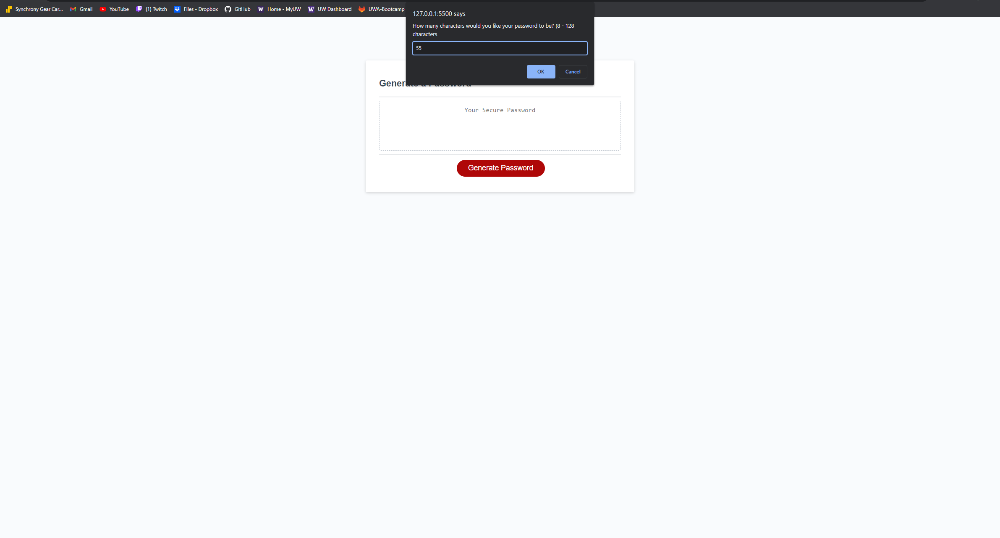
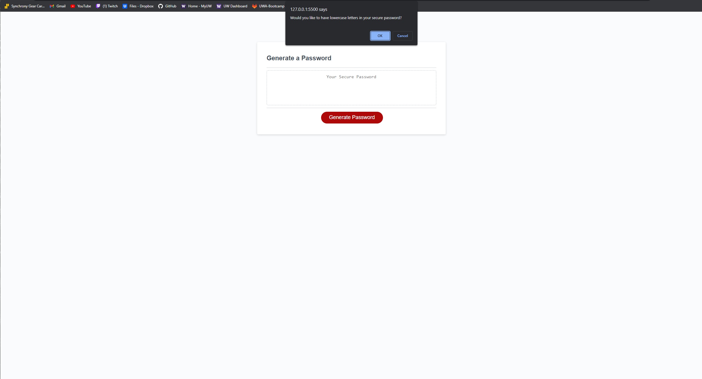
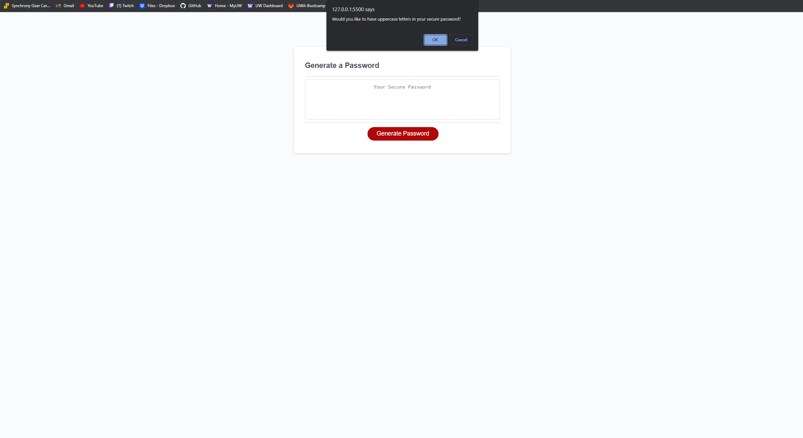
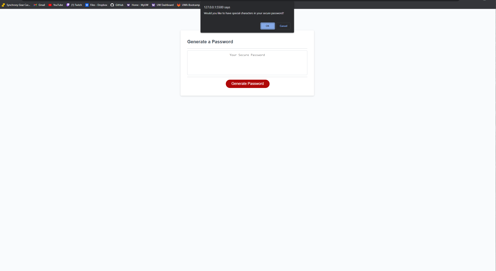
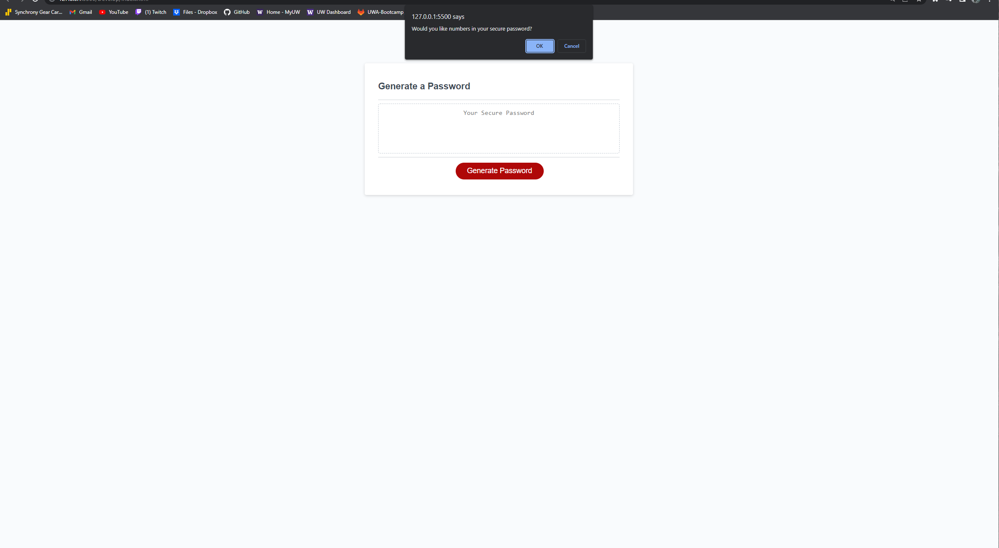
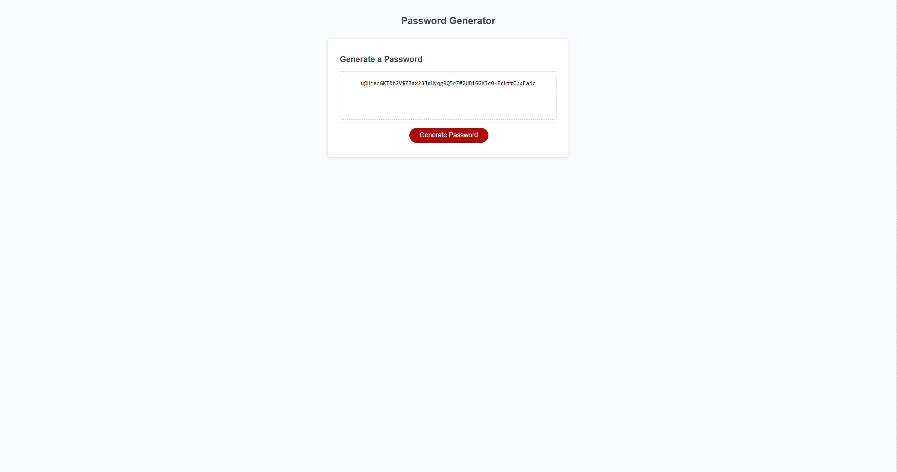

# TopSecretPassword

Generate a completely random, and unique password. 

# Description 
Nobody likes when their passwords get compromised.. so why not generate a completely random, and unique password? Well you are in luck! With this generator, you will be prompted with a series of questions. First, you will be asked how many characters you would like your unique password to be. If left blank, or any text is added that is not a number, you will be prompted with an alert to enter a proper value. Once that stage is complete, you will then be asked if you would like lowercase letters in your secure password. The next question will ask if you would like to have uppercase letters in your secure password. Following this, you will be asked if you would like to have special characters in your secure password. Finally, you will be asked if you would like numbers in your secure password. Once all answers have been answered correctly, a unique password will display inside the text area.

That all being said, there are a a few variations you can choose between. With this generator, lets say you do not want uppercase letters in your password. Simply just click cancel when prompted for your choice on uppercase, and you will see your password contains NO uppercase letters. This gives the user more freedom in making decisions based on how complex, or simple they want their password to be. Want only lowercase letters, simply click cancel on uppercase, special character, and numbers, and you will be generated a unique password that only contains lowercase letters. The choice is yours! 

# Screenshot

# Links

Website : https://grindboiwes.github.io/TopSecretPassword/

Github : https://github.com/GrindBoiWes/TopSecretPassword

# Credit

Various blogs/websites and youtube videos on setting up password generators.
